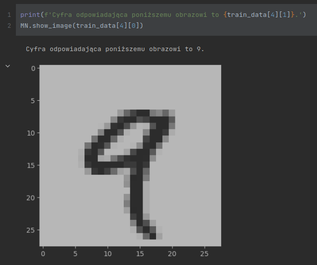
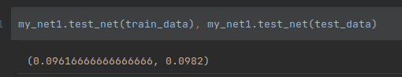
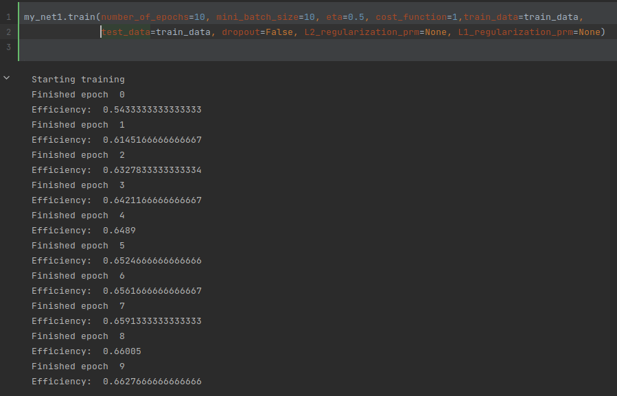
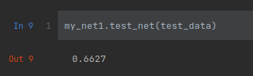
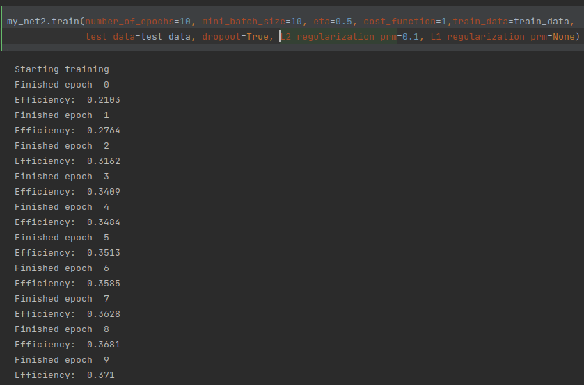

# Neural Network

Neural Network project is an implementation of atificial Neural Network :D :D.
  
In this repository there are two important files:
1) Network.py: 
In that file there is a NeuralNetwork class, which is an implementation of a neural network that allows you to create a neural network with dense layers (Fully Connected Layer). The number of layers in the network and the number of neurons in each layer is determined by the argument of the constructor. The class also implements backpropagation, allows you to train the network and apply such regularizations as DropDown, L1/L2 regularizations. The class also allows you to save a network to a file and load network from a file.
2) MNIST_loader.py  
This file contains functions that allow you to load data for training and testing from files in the "MNIST" directory into ndarray objects (into numpy arrays). This data is MNIST (images of handwritten digits and their corresponding digits).

If you would like to, you can read [this juputer notebook](notebook.ipynb) instead of reading this README.md file. Content of that notebook is almost the same as contect of this file. All screenshots, which are in this file, are from that notebook.

Instruction for use:: 
First import all necessary modules.
~~~ python
from Network import Network
import MNIST_loader as MN
~~~
Then you need to load data used to train and test the network. You can use load_training_tuples and load_test_tuples functions fot that.
~~~ python
train_data = MN.load_training_tuples()
test_data = MN.load_test_tuples()
~~~
The load_training_tuples function returns a list of tuples (list[tuple[np.ndarray, int]). The first element of each tuple is a numpy array representing the image of a digit. The second element of the tuple is an int being that digit. Exactly such a list is required by the network training function.
A load_test_tuples function does the same as load_training_tuples, but returns data for testing. (The MNIST collection defines 60,000 examples for training and 10,000 examples for testing.)

You can use "show_image" function to display an image.

 
---
Let's create a simple network:
~~~ python
my_net = Network(shape=(784, 512, 1024, 2048, 10), name="net1")
~~~
To the constructor you need to pass the shape of the network - an information about how many layers the network has and how many neurons are in each layer.

The `test_net` method is used to test the network. It returns the number of all correctly qualified examples divided by the number of all examples. 
 
As you can see, the created network, initialized with random weights, has an efficiency of 9.61% on the training set and 9.82% on the test set. There are 10 classes, expected initial effectiveness is around 10%.

Now you can start training the network. The 'train' function is used for this.

~~~ python
my_net.train(epoch=10, mini_batch_size=30, eta=0.3, cost_function=1,train_data=train_data,
             test_data=test_data, dropout=False, L2_regularization_prm=0.1, L1_regularization_prm=None)
~~~
- The epoch argument is the number of epochs to run.
- The mini_batch_size argument specifies the size of the mini batch.
- The eta argument stands for learning_rate and specifies its value.
- The cost_function argument can have two values. When it takes value
1 - the quadratic cost function (MSE cost function) will be used for training.
2 - the entropy cost function will be used for training.
- The test_data argument is optional. Specified, means the data, on which the network will be tested after each epoch. In the absence of this argument (or its value equal to None), the network will not be tested during training.
- The drop_out argument means whether dropdown should be used during training. If True, the dropout will be applied, if False, the dropout will not be applied. Default value: False.
- The L1_regularization_prm argument is the L1 regularization coefficient. If the value of this argument is None, L2 regularization will not be applied. The default argument value is None.
- The L2_regularization_prm argument is the L2 regularization coefficient. If the value of this argument is None, L2 regularization will not be applied. The default argument value is None.

Let's forget about regularization for now and see how the network will train itself over 10 epochs. Exceptionally we will use the same data for testing and training the network. The puprose is to see if the network is able to overtrain.  
 
As you can see, after 10 epochs, the network has achieved an efficiency of 0.66.

Despite the lack of regularization the net has almost exactly the same efficiency on test set and on training set. Even without regularization, the network didn't overtrained. No wonder, the network architecture is very simple, it has only one hidden layer with 30 neurons. 
 

---
Now let's create a new network with the same architecture and try to train it using L2 regularization and dropdown. This time, we will test the network every epoch on test data, data not used during training.
~~~ python
my_net2 = Network((784, 30, 10))
my_net2.test_net(train_data), my_net2.test_net(test_data)
~~~
 
After 10 epochs, the network achieved an efficiency of 37.71% on the test set.

---
To save a network from a file and then load a network from a file, use the save and load functions.
~~~ python
my_net1.save(add_shape = False, name='my_net1')
loaded_network = Network.load('my_net1.network')
~~~

